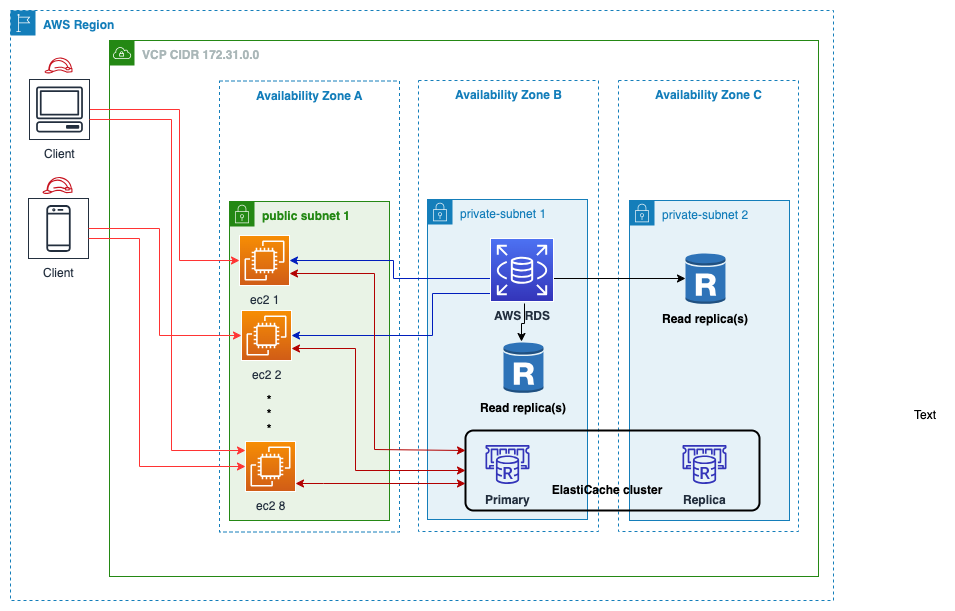
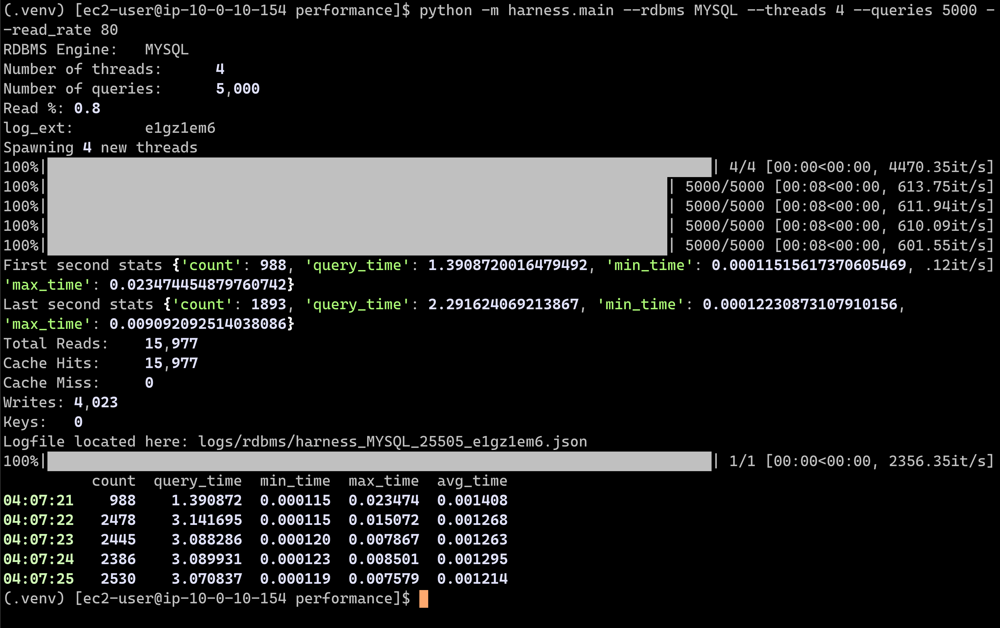

# Amazon ElastiCache Caching for Amazon RDS
__Optimize cost, increase throughput and boost performance of Amazon RDS workloads using Amazon ElastiCache__

The purpose of this project is to help you reproduce test harness of Relational Database Management Systems (RDBMS) like [Amazon Relational Service](https://aws.amazon.com/rds/) (RDS) with and without a Cache such as [Amazon ElastiCache](https://aws.amazon.com/elasticache/).

In-memory caching improves application performance by storing frequently accessed data items in memory, so that subsequent reads can be significantly faster than reading from the primary database that may default to disk-based storage.

### Sample dataset

For practical purposes the data used for this test is the __airportdb__ database with approximately 2GB in size and consists of 14 tables containing a total of 56 million records.

You can bring your own database and run your own queries as well to have an initial idea of the benefits caching can have over your specific workload.

### Architecture

The following Architecture diagram shows the test environment using [Amazon Elastic Compute Cloud](https://aws.amazon.com/pm/ec2/) (EC2) as the compute layer where 1 or more instances can be used to send requests to our databases RDS + ElastiCache. For this particular test [Amazon ElastiCache for Redis](https://aws.amazon.com/elasticache/redis/) is used, but note that a similar test can be done using [Amazon ElastiCache for Memcached](https://aws.amazon.com/elasticache/memcached/).



## Deploy Infrastructure

### Option 1: Deploy new resources with sample data

__Prerequisites__

- [Python 3.8+](https://www.python.org/)
- [NodeJS 16+](https://nodejs.dev/)
- [AWS Account](https://aws.amazon.com/)
- [AWS CLI 2+](https://aws.amazon.com/cli/)
- [AWS CDK 2+](https://aws.amazon.com/cdk/)
- [AWS EC2 KeyPair](https://docs.aws.amazon.com/AWSEC2/latest/UserGuide/ec2-key-pairs.html)

1. Clone this repository
```bash
git clone git@github.com:aws-samples/amazon-elasticache-caching-for-amazon-rds.git
cd amazon-elasticache-caching-for-amazon-rds
```

2. Deploy the Infrastructure
```bash
cd infrastructure
# Create a Python environment
python3 -m venv .venv
source .venv/bin/activate
# Install required packages
pip install -r requirements.txt
cp .env.example .env
```

3. Modify `.env` with Accound and AWS Region
```
AWS_ACCOUNT=<your_AWS_account_id>
AWS_REGION=<your_AWS_region>
```

4. Run CDK deployment
```bash
cdk bootstrap
cdk synth
cdk deploy -c keyName=<your_keypair>
```

### Option 2: Run tests on your existing infrastructure

__Prerequisites__

- [Python 3.8+](https://www.python.org/)
- EC2 Instace with access to an ElastiCache and RDS clusters

1. Log into the Bastion Host EC2 instance

2. Clone this repository
```bash
git clone git@github.com:aws-samples/amazon-elasticache-caching-for-amazon-rds.git
cd amazon-elasticache-caching-for-amazon-rds
```

## Run Performance Tests

1. Configure performance test

```bash
cd performance
# Create a Python environment
python3 -m venv .venv
source .venv/bin/activate
# Install required packages
pip install -r requirements.txt
cp .env.example .env
```

2. Configure `ElastiCache` and `RDS` details from the secret manager and cloudformation outputs on the `.env` file
```
ELASTICACHE_HOST="<dns_configuration_endpoint>"
ELASTICACHE_PORT=6379
MYSQL_HOST="<dns_configuration_endpoint>"
MYSQL_DB="db_name"
MYSQL_USER="admin"
MYSQL_PASS="secret_password"
MYSQL_PORT=3306
```

3. Run Harness Test
```bash
python -m harness.main --rdbms MYSQL --threads 4 --queries 1000000 --read_rate 80
```

The output in the console should look similar to the following screenshot:



### Credits

#### License for the airportdb Database
This work is adapted from the Flughafen DB by Stefan Proell, Eva Zangerle, Wolfgang Gassler, which is licensed under the Creative Commons Attribution 4.0 International (CC BY 4.0) License. To view a copy of this license, visit https://creativecommons.org/licenses/by/4.0/ or send a letter to Creative Commons PO Box 1866, Mountain View, CA 94042.

FlughafenDB. (2015). Stefan Proell, Eva Zangerle, Wolfgang Gassler. www.flughafendb.cc. https://doi.org/10.5281/zenodo.3968361


## Security

See [CONTRIBUTING](CONTRIBUTING.md#security-issue-notifications) for more information.

## License

This library is licensed under the MIT-0 License. See the LICENSE file.
