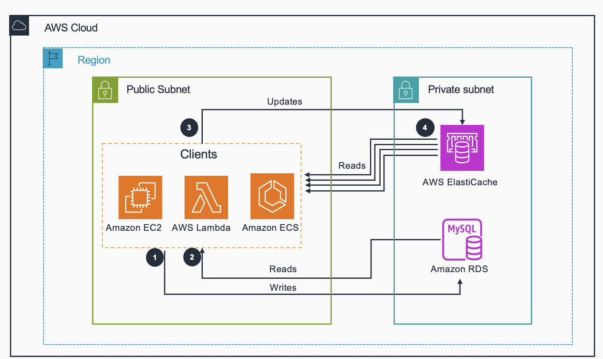
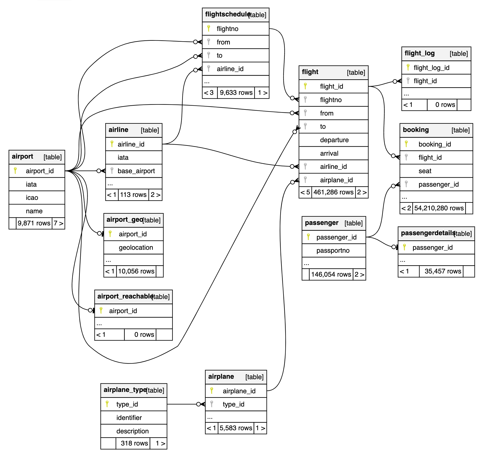

# Guidance for Optimizing Cost of RDS for MySQL

## Table of Content

1. [Overview](#overview)
    - [Cost](#cost)
2. [Prerequisites](#prerequisites)
    - [Operating System](#operating-system)
    - [Services](#services)
    - [Client Software](#Client-Software-dependencies)
    - [Third party tools](#Third-party-tools)
3. [Deployment Steps](#deployment-steps)
4. [Deployment Validation](#deployment-validation)
5. [Running the Guidance](#running-the-guidance)
6. [Next Steps](#next-steps)
7. [Cleanup](#cleanup)
8. [FAQ, known issues, additional considerations, and limitations](#faq-known-issues-additional-considerations-and-limitations)
9. [Credits](#credits)
10. [Notices](#notices)

## Overview

This guidance was created to help customers with database workloads that have high read:write (70:30) ratios and are looking to boost application performance, and at the same time reduce overall cost. Qualifying database workloads will see an increase in the number of transactions, a reduction in response time, and an overall reduction in cost. It is expected that two services together can perform a task faster. However, when AWS ElastiCache is paired with qualifying database workloads not only the performance increases but the total cost of the two services is lower than the cost of scaling the database alone to deliver a similar performance.

#### Architecture overview ####



### Cost

You are responsible for the cost of the AWS services used while running this guidance.

The cost for running this guidance will depend on the infrastructure used. Exisitng infrastructure may be used for no additional cost or individual services may be configured as below. All services are assumed to be in the US East (N. Virginia) region with on-demand pricing option. Using Amazon Elastic Compute Cloud (Amazon EC2) instance type t4g.micro with 8GB of Amazon Elastic Block Store (EBS) to run the simlated applicaiton workload. AWS ElastiCache provisioned instance type cache.t2.x.small utilizing 1 primary and 1 read replica. AWS RDS MySQL database using instance type (db.t3.micro), and storage(30 gp2 GB). For any service the cost will greatly depend on the, instance type, and RDS licensing model selected. Reserved pricing will greatly reduce cost for EC2, RDS, and ElastiCache. AWS ElastiCache is also available in a serverless offering where a pay-per-consumption cost model is applicable.

| Service               | Assumptions                                       | Estimated Cost Per Month |
| --------------------- | ------------------------------------------------- | ------------- | 
| Amazon EC2            | 1 instance (t4g.micro) used for 730 hours         | $20.13 |
| Amazon ElastiCache    | 2 Instance (cache.t2.small) used for 730 hours	| $24.82 |
| Amazon RDS MySQL      | 1 Instance (db.t3.micro) used for 730 hours       | $15.86 |
| Total                 |                                                   | $40.81|

We recommend creating a [Budget](https://docs.aws.amazon.com/cost-management/latest/userguide/budgets-managing-costs.html)  through [AWS Cost Explorer](https://aws.amazon.com/aws-cost-management/aws-cost-explorer/) to help manage costs. Prices are subject to change. For full details, refer to the pricing webpage for each AWS service used in this Guidance.

## Prerequisites

This guidance is targeted towards those familiar with the AWS RDS Service. The users are expected to have a basic understanding of AWS RDS service and database access patterns. It guides users how to utilize AWS ElastiCache in addition to their existing relational database. Effectively paring your database with a caching service. It should be run in US East N. Virginia region. This guidance is not intended for production workloads. For example, recommended security configurations are not included. For production systems it is strongly recommended that data should be encrypted both in transit and at rest.


### Operating System

This guidance runs in the AWS cloud utilizing an AWS EC2 compute instance based on the Amazon Linux 2023 AMI. With network access to both AWS RDS database service and AWS ElastiCache (both are required). In addition the EC2 compute instance will require public access on port 8888. The included Cloud Formation template can be used to create such an EC2 instance. The sample code also includes two Jupyter notebooks to analyze and visually plot the performance results. Note that public access to the EC2 host on port 8888 should be enabled from your computer only not all end user computers.

### Services

This quidance depends on AWS RDS MySQL, and AWS ElastiCache services. It is beyond the scope of this guidance to create those services. Pleae reffer to [AWS RDS](https://aws.amazon.com/rds/) and AWS [ElastiCache](https://aws.amazon.com/elasticache/)

### Client Software dependencies 

Install dependencies by executing the `setup_host.sh` script. This script will install gcc python3-devel at the host level. In addition to the two packages installed a python virtual environment is created with dependent modules installed from the requirements.txt file. The python modules are only committed to the virtual environment not the host. The includes commands are optimized to work on the EC2 instance created by the included CloudFormation template and are specific for the Amazon Linux 2023 AMI al2023-ami-2023.4.20240319.1-kernel-6.1-arm64. This image is specific to the us-east-1 region. Other OS or AMI configuration may require additional steps.

### Third-party tools

This guidance uses Jupyter lab and the included notebooks to visualize/plot the performance data captured in the json logs.
Seed data is from the FlughafenDB. (2015). Stefan Proell, Eva Zangerle, Wolfgang Gassler. www.flughafendb.cc
However, by modifying the read and write queries, any seed data can be used. 

### AWS account requirements

Ability to create an EC2 instance and networking configuration to permit access to both the RDS server and the ElastiCache service and public access to the EC2 on port 8888 from the customer end computer only. (CIDR/32)

**Example resources:**
- RDS MySQL Database with the English version of flughafendb data loaded from the third party location mentioned above.
- AWS ElastiCache
- VPC
- SSH key in your region of choice

### Supported Regions

All regions where AWS RDS MySQL and AWS ElastiCache are offered.

## How to load the seed data

The seed data may be loaded from here www.flughafendb.cc. Follow the steps in the README document for "Import using mysqldump" steps for the English version of the data. However name the database airportdb. The below steps are  slight modification of the steps suggested in the README file, using password authentication and using the airportdb name for the target database.

### Change to the directory with the zipped dump
```
cd english
```

### Concatenate the whole data set in one gzipped file 
```
cat flughafendb_large.sql.gz.part-* > airportdb.sql.gz
```

### Create a new database in your MySQL instance
```
mysql -h <your-host> -u admin -p -e "CREATE DATABASE airportdb;"
Enter password:
```

### Import the dataset
```
zcat airportdb.sql.gz | mysql -h <your-host> -u admin -p airportdb
Enter password:
```

## Deployment Steps

1. If you have an existing EC2 instance with at least 1GB of memory using the Amazon Linux 2023 image with network configuration that will allow it to connect both to your RDBMS and ElastiCache services and SSH connectivity. Alternately and for you convenience the repository also includes a cloud formation template called guidance-ec2.yaml. Use AWS CloudFormation and with this template to create an EC2 instance. If you decide to use the CloudFormation template please specify all parameters that are valid for your AWS VPC (Virtual Private Cloud) Such as the SSH key to use, the AMI image ID, security group name and subnet group name.
2. Log in to your instance from the AWS console via Session Manager or via SSH.
3. Switch to the ec2-user ``` sudo su - ec2-user```, install git ```sudo yum install git -y```
4. Clone the repository by executing ```git clone <this repo name> ```
5. Change directory to the guidance directory ```cd amazon-elasticache-caching-for-amazon-rds/guidance```
6. Execute the setup_host script ```./setup_host.sh```
7. Log in to the same instance from a separate session and navigate to the same directory and execute ```./setup_jupyter.sh``` script. Enter the initial password. Commit the password to memory as you will have to enter it once the notebook is running. Note: This Jupyter configuration is not meant for a production environment as it uses a self-signed certificate. For a proper production environment follow your company standards to acquire a certificate from a known Certificate Authority. The Jupyter server used in this guide uses a self-signed certificate that your web browser will probably not trust. You can accept the certificate or follow internal standards and repalace the Jupyter server key and certificate in the ~/.jupyter/jupyter_lab_config.py file. More documentation is available [here](https://jupyter-notebook.readthedocs.io/en/6.2.0/public_server.html#running-a-public-notebook-server)
8. In your computer browser enter your EC2's public IP address and port for example: ```https://1.2.3.4:8888`` Unless you configured Jupyter with other than the self signed certificate accept the warning and continue.
9. Enter the password for your Jupyter notebook. (The password entered at step 6)
10. In your first session edit the .env file and update it with your database and ElastiCache related information.
11. Source the .env file ```source .env``` to export the parameters.

## Deployment Validation

It is not part of this guidance to install and configure client applications for database and ElastiCache connectivity. However, at this point you can install client applications to validate connectivity to both the database and ElastiCache.

## Running the Guidance

* Execute the scenario01.py script. This workload accesses the database only and captures command level performance data in a logfile. In the directory where you executed the setup_host.sh and the Python virtual environment is activated, the first connection, execute: ```python scenario01.py --users 10 --queries 1000 --read_rate 80```
* If deployment was correct you should see a response similar to this. (small sample execution)
  
Sample execution:

```
(.venv) [ec2-user]$ python scenario01.py --users 1 --queries 10 --read_rate 80
Reads: 8
Writes: 2
Logfile located here: logs/scenario01_139007_mwae8c4k.json
```

* Open the Jupyter notebook plot_results_db_only.ipynb file and update the logfile name in the second cell. For example ```log_pattern = 'scenario01_139007_mwae8c4k.json```

* From the run option select run all cells. The output of the last cell will show both the number of executions per second and the average response time. 

* To compare the performance boost provided by ElastiCache repeat the above steps but use the scenario02.py script. For example execute ```python scenario02.py --users 1 --queries 10 --read_rate 80``` The output should be similar.

Sample execution result:

```
(.venv) [ec2-user]$ python scenario02.py --users 1 --queries 10 --read_rate 80
Connected to Database
Connected to ElastiCache
Reads: 10
Writes: 0
Cache hits: 10
Cache misses: 0
Logfile located here: logs/scenario02_176908_0y2qr55f.json
```

* Open the Jupyter notebook plot_results_db_and_cache.ipynb file and update the logfile name in the second cell. For example ```log_pattern = scenario02_176908_0y2qr55f.json```

Then select run all cells to plot the performance of the second scenario. Note that a small execution may not be sufficient to demonstrate the performance advantage of adding a cache. 

## Next Steps

To see the potential improvements ElastiCache can provide to your application. Replace the database connection parameters with your test database values and modify the READ_QUERY and WRITE_QUERY text parameters to fit your schema.

## Cleanup

To clean up your environment stop all services and delete the MySQL database and ElastiCache cluster. Finally delete the EC2 instance from where you executed the commands by first removing the termination protection of the instance then deleting the CloudFormation stack that created the EC2 instance. 

## FAQ, known issues, additional considerations, and limitations

Caching is beneficial for databases that execute a high read to write ratio workloads. For example 80:20 read to write workloads. The sample data provided in the airportdb is subject to change and accepting end user licensing agreement.


**Additional considerations **

- This Guidance creates insecure Jupyter Notebook 
- Cashing is not applicable for workloads that are write intensive meaning that the majority of transactions are not repetitive read transactions.

For feedback please access the github page <here>

### Credits

#### License for the airportdb Database
This work is based on the FlughafenDB by Stefan Proell, Eva Zangerle, Wolfgang Gassler, which is licensed under the Creative Commons Attribution 4.0 International (CC BY 4.0) License. To view a copy of this license, visit https://creativecommons.org/licenses/by/4.0/ or send a letter to Creative Commons PO Box 1866, Mountain View, CA 94042.

FlughafenDB. (2015). Stefan Proell, Eva Zangerle, Wolfgang Gassler. www.flughafendb.cc. https://doi.org/10.5281/zenodo.3968361



## Security

See [CONTRIBUTING](CONTRIBUTING.md#security-issue-notifications) for more information.

## License

This library is licensed under the MIT-0 License. See the LICENSE file.

## Notices
Include a legal disclaimer

*Customers are responsible for making their own independent assessment of the information in this Guidance. This Guidance: (a) is for informational purposes only, (b) represents AWS current product offerings and practices, which are subject to change without notice, and (c) does not create any commitments or assurances from AWS and its affiliates, suppliers or licensors. AWS products or services are provided “as is” without warranties, representations, or conditions of any kind, whether express or implied. AWS responsibilities and liabilities to its customers are controlled by AWS agreements, and this Guidance is not part of, nor does it modify, any agreement between AWS and its customers.*

